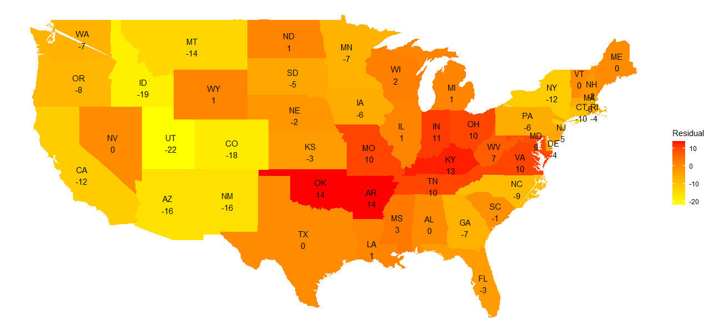

```{r setup, include=FALSE}
knitr::opts_chunk$set(
  fig.align = "center",
	fig.width = 7,
  echo = TRUE)
library(bookdown)
library(knitr)
```

```{r libraries, include=FALSE}
library(dplyr)
library(car)
library(tidyr)
library(glmnet)
library(ggplot2)
```

\pagebreak

# Findings

## Key Findings

Given our preferred model the most important predictors for cancer death rates for a given state were incidence rates, median income and private health care coverage. All predictors for the model are in the table below with the parameter estimate and a scaled model to show importance of predictors. This shows that `incidenceRate` and `log medianIncome` followed by `PctPrivateCoverage` have the largest influence over death rates. The table shows in the first row the unscaled model parameters and in the second the scaled model parameters, a larger value indicates the predictor having more affect on death rates.

```{r, eval=FALSE, include=FALSE}
lasso.coefs.tab <-cbind(lasso.coefs, lasso.scaled.coefs.ordered)
colnames(lasso.coefs.tab) <- c("Non-Scaled", "Scaled")
save(lasso.coefs.tab, file="lasso.coefs.tab.rdata")
```

\scriptsize

```{r, echo=FALSE}
load(file="lasso.coefs.tab.rdata")
kable(t(lasso.coefs.tab[lasso.coefs.tab[, 1] != 0, ]), row.names=FALSE, align='c')
```

\normalsize

Understandably cancer diagnoses are a key predictor for death rates, with an increase in the number of cancer diagnoses by 50 per 100,000 increasing cancer death rates by 10 per 100,000. This of course does not imply that there should be a policy to decrease cancer diagnoses. Increasing cancer diagnoses will lead to more people with cancer on death certificates even if cancer may not have been the primary cause of death.
Wealthier north western states have similar mean incidence rates to poorer south western states but much lower death rates showing that diagnoses are a good baseline however additional predictors for poverty and coverage give a stronger model.

Due to the strong collinearity of many variables and thus our choice of regression method, we can not give a strong interpretation for keeping all but one variable the same and giving the associated change in death rates. An increased Death Rate is more likely if a county has a low median income, low private coverage, these though will be dependent on low employment and high unemployment percentages which may be because of a low education rate. Due to many variables explaining the same "information" about death rates the LASSO method reduces model complexity, for example even though Percent Public Coverage is correlated well with death rates it can be left out of the model as it is strongly correlated with both percent private coverage and employee provided coverage.

## Summary of EDA

### Missing/Incorrect Values and Outliers

We identified 152 missing values in __Percent Employed 16 and Over__. As these values were Missing Completely at Random we imputed them back into our data set with a linear model. We also identified values in __Average Household Size__ that were unreasonably small. We believed this is an error in data entry and we scaled them by 100.
For outliers, We removed 'Union County, Florida' and 'Williamsburg City, Virginia' because of there high __Incidence Rates__.

### Transformations

In order to fulfill the model assumptions, namely linearity, normality, and constant variance, we performed log transforms for two variables: __Median Income__ and __Percent Black__ which suffered the most among all variables. Although the transformations did not cure the problems, they result in improvements for both. For other variables, we deduced that they are sufficient for the model assumptions and hence did not perform any transformations for model simplicity.

## Modelling Approach

We used Stepwise Regression, RIDGE Regression and LASSO Regression to build our model. We compared the outputs and the variables selections of these models. We also analyse the goodness of fits of these models using Leave-one-out cross validation, $R^2$ statistics and residuals analysis.
We did not include __Geography__ as it is an id variable. __Binned Income__ was not used in the model as more information was included in __Median Income__.

### Stepwise Regression

We used __Bayesian Information Criteria(BIC)__ in our analysis. This penalises additional parameters harder than __Akaike information criterion(AIC)__ which agrees with parsimony in our modelling. We performed forward, backward and hybrid stepwise regression to account for local minimums. In all of the models that were generated we notice that we have groups of parameters that are similar and hence induce multicollinearity in the models. For example, we see both __Percent Married__ and __Percent Married Households__ in the models and as stepwise methods do not account for multicollinearity this causes increases in the variance of our coefficient estimates and makes the model sensitive to changes, thus reducing drastically the predictive power of the model. In order to address the issue of multicollinearity we apply Ridge and Lasso techniques which account for this.

### RIDGE and LASSO Regression

We implemented penalised regression models for RIDGE and LASSO to counteract the multicollinearity issues in the data. RIDGE Regression gave a strong predictive model however all variables were included and many were close to 0.
The LASSO model contains eight variables which is the simplest model among our approaches and gave similar predictive power. As the purpose of this report is to reveal patterns in the mortality rate, we believed it is best to choose a simple model for stronger explanatory power.

### Final Model Choice and Diagnostics

We used residuals plot and QQ plot to diagnose the stepwise regression model. Both plots are satisfactory, agreeing with model assumptions. Performing Leave-one-out cross-validation for the stepwise model gave an $R^2$ value of $0.4621$.
Doing the same cross-validation for our Ridge and Lasso model gave us an $R^2$ of $0.4436$ and $0.4441$ respectively.

The stepwise model fits the observed data the best among all our models. The Lasso and the Ridge model is similar in this sense.
However, the Lasso model contains the least number of predictor variables and we believed this is the most important criterion.
Thus from our analysis briefly outlined above and in the next section we recommend the LASSO model due to its mix of predictive and explanatory power as well as being a simple model.

## Limitations of Analysis

One limitation of using LASSO regression is that it does not completely handle the problem of multicollinearity, however it reduces the multicollinearity present in the modelby a large amount. Often it selects one feature from a group of correlated features, which happens arbitrarily in nature. In our model, this happens on the three health care coverage variables, where Percent Public Coverage was dropped. However, in our case, this is not a severe problem as we focus more on the explanatory power than the predictive power. LASSO regression reduces our model to 8 predictor variables and this leads to a loss of predictive power. At the same time, the log transformed variables are difficult to interpret.

Another issue is that LASSO models are difficult to diagnose. Unlike stepwise regressions, it is difficult to produce hypothesis tests to check the statistical significance of the predictors.

## Further Improvements to the Model

In order to develop this model in the future and improve its capabilities we make the following suggestions. For a more complex model with a large number of predictors including the state as a variable will mean each state's unique qualities can be considered by this coefficient, but will greatly increase the complexity of the model. Another improvement is to add different health coverage costs for different states, as for example a low income state with cheap private insurance is likely to also have low death rates, but the model does not account for this.


## Areas that do not conform the general pattern

Below we a heatmap of the average residuals according to our model (Fig.1) where we have illustrated the average performance of our model in each state. For states that are yellow and have a negative quantity the model is overfitting and predicitng a higher death rate than what was observed, whereas the red states the model is underfitting and thus predicitng a lower quantity than the death rate we observed. We aim to have the average residual for each state close to 0. We further analyse this in section 2.3.



\pagebreak

# Statistical Methodology

```{r loadData, include=FALSE}
## Included Libraries
# For pipe operator and general mutation
load('cancer.rdata')
```

## Outcomes of EDA

### Missing Or Incorrect Values

We saw counties with missing values in Percentage Employed 16 and Over and we concluded that the data is Missing Completely at Random. In order to rectify this we impute this data by fitting a linear regression model of Percentage Employed 16 and Over on the remaining variables to estimate what these values would be. (See Appendix 5.1.1).

```{r impute, include=FALSE}
# Impute the missing data seen in the data set
mod1=lm(PctEmployed16_Over~+incidenceRate+medIncome+binnedInc+povertyPercent+MedianAgeMale+MedianAgeFemale+AvgHouseholdSize+PercentMarried+PctUnemployed16_Over+PctPrivateCoverage+PctEmpPrivCoverage+PctPublicCoverage+PctBlack+PctMarriedHouseholds+Edu18_24,cancer)
missdf = cancer[which(is.na(cancer$PctEmployed16_Over)==TRUE),]
imputed = predict(mod1,missdf)
cancer[which(is.na(cancer$PctEmployed16_Over)==TRUE),"PctEmployed16_Over"] = imputed
```

For counties with Average Household Size less than one we took the decision to scale these values by 100 and kept them in the data set. This fixed the normality of Average Household Sizee as shown in the histogram. (Fig.2)

```{r averageHouseholdSize, echo=FALSE,fig.cap="Histograms before(Left) and after(Right)", fig.asp=0.5}
# Scale average household sizes that are less than 1 by 100
par(mfrow=c(1,2))
hist(cancer$AvgHouseholdSize, breaks=30, xlab="AvgHouseholdSize", main="Histogram of AvgHouseholdSize")
cancer[which(cancer$AvgHouseholdSize < 1), ]$AvgHouseholdSize <-
  100*cancer[which(cancer$AvgHouseholdSize < 1), ]$AvgHouseholdSize
hist(cancer$AvgHouseholdSize, breaks=30, xlab="AvgHouseholdSize", main="Histogram of AvgHouseholdSize")
```

### Outliers {#outliers}

We found counties with high incidence rates, namely __Union County, Florida__ and __Williamsburg City, Virginia__. We looked into the cook's distance plots (Fig.3) and noticed only 'Williamsburg City, Virginia' has large cook's distance and hence influential. The first cook's distance plot used a linear model with only incidenceRate as the predictor variable. The second used all the numerical variables. We concluded although __Union County, Florida__ has high leverage, it is not influential and hence should be kept in our data set.


```{r incidenceRateRemoval, echo=FALSE, fig.asp=0.5, fig.cap="Cook's distance plots of models with only incidence Rate(Left) and all variables(Right)"}
# Cook's distance Plot
par(mfrow=c(1,2))
plot(lm(deathRate ~ incidenceRate,data=cancer),4)
plot(lm(deathRate ~ .,data=cancer[-c(1,4)]),4)
# Removing outlier incidence rates 'Williamsburg City, Virginia'
cancer <- filter(cancer, incidenceRate <= 850)
```

### Transformations {#transformations1}

We transformed Percent Black by first shifting the values upwards by 0.05, to ensure we have no zero values, then take a log transform. We also transformed Median Income by again taking a log transformation. We performed these transformations to ensure the data was not heavily skewed and allowed for a more accurate model. (See Appendix 5.1.3)

```{r transformationsaaaa, include=FALSE}
# Log transforming the heavily skewed distributions of PctBlack and medIncome
cancer$logpctblack = log(cancer$PctBlack+0.05)
cancer$logmedincome = log(cancer$medIncome)
```

The residual plots (Fig.4) show the improvements in homoscedasticity in Percent Black and Median Income after log-transform respectively.

```{r heteroscedasticity1,echo=FALSE, fig.asp=0.5, fig.cap="Residuals plot Percent Black(Left) and Log Percent Black(Right"}
# Showing improvements in homoscedasticity in PctBlack
par(mfrow=c(1,2))
plot(lm(deathRate~PctBlack,data=cancer),1)
plot(lm(deathRate~logpctblack,data=cancer),1)
```

## Modelling Approach and Variable Selection

### AIC and BIC Forward and Backward Variable Selection

We performed forward, backward and hybrid stepwise regression according to BIC to ensure a more parsimonious model. We saw that the models generated for BIC are the same. It has 11 variables and the estimates are shown in Table 1.

```{r stepwise, include=FALSE}
# Below we perform stepwise regression for both AIC and BIC
# cancermodel = cancer[,-c(1,3,15)]
cancermodel <- cancer %>% select(
  !c("Geography", "medIncome", "binnedInc", "PctBlack"))
c0=lm(deathRate~1,cancermodel)
cmax=lm(deathRate~.,cancermodel)
forwardoptimalBIC = step(c0,direction="forward",
scope=list("lower"=c0,"upper"=cmax),trace=0,k=log(3045))
backwardoptimalBIC = step(cmax,direction="backward",
scope=list("lower"=c0,"upper"=cmax),trace=0,k=log(3045))
hybridoptimalBIC = step(c0,direction="both",
scope=list("lower"=c0,"upper"=cmax),trace=0,k=log(3045))
```

For the model generated we can see from the summary output (See Appendix 5.2.1), with strong evidence, that all the coefficients are different from zero. From the output we would expect multicollinearity in these models due to variables that measure similar or opposite quantities, for example Percent Married and Percent Married Households.

```{r summaryAICBIC, include=FALSE}
# We compute the summaries of the stepwise model
summary(hybridoptimalBIC)
```

We computed the Variance Inflation Factors (VIF) for this model and found that there are numerous values that are at least 5 indicating multicollinearity in the predictors. In particular, we saw a VIF of at least 10 in Percent Married and a VIF of 8 in Percent Married Households. As well as in log(Median Income), Percent Employed 16 and Over, Percent Employers Private Coverage and Percent Private Coverage. Due to this frequent multicollinearity between the predictors in the stepwise model, the stepwise model is not a suitable approach as multicollinearity was not taken into account and thus we proceeded with Ridge and Lasso Regression in the following sections, hoping for a model with reduced multicollinearity.

To complete the section on stepwise regression we performed leave-one-out cross-validation (in order to compute the $R^2$ of the stepwise models and also the Root Mean Squared Error (See Appendix 5.2.1). This allowed us to compare these models with the Ridge and Lasso models we generate in the enxt sections. Performing this we see in the stepwise model that we have an $R^2$ value of 0.4623.

```{r LOOCVforStepwise, cache=TRUE, include=FALSE}
library(caret)
#specify the cross-validation method
#fit a regression model and use LOOCV to evaluate performance
loocv <- function(lm1, data=cancer) {
  ctrl <- trainControl(method = "LOOCV")
  xnam <- names(lm1$coefficients)[-1]
  fmla <- as.formula(paste("deathRate ~ ", paste(xnam, collapse= "+")))
  model <- train(fmla, data = data, method = "lm", trControl = ctrl)
  return(model)
}
hybridoptimalBIC.loocv <- loocv(hybridoptimalBIC,data=cancermodel)
```

### RIDGE Regression

To address the multicollinearity present in the data we assessed the viability of a Ridge Regression Model. For this we fitted all continuous variables as predictors using the `glmnet` package.

The trace plot shows that the Ridge penalisation method reduced many variables close to 0 but did not remove any variables from the model itself suggesting that these predictors are insignificant when it comes to prediction. (See Apendix 5.2.2)

```{r Ridge 1, include=FALSE}
library(glmnet)

# Create Data Matrix
cancer.dm <- cancer %>%
  select(!c("Geography", "medIncome", "binnedInc", "PctBlack", "deathRate")) %>%
  data.matrix()

lm.ridge <- glmnet(cancer.dm, cancer$deathRate, alpha=0)
lm.ridge.cv <- cv.glmnet(cancer.dm, cancer$deathRate, alpha=0)

# Create Model Plot Func
traceLogLambda <- function(lm1, lm1.cv, ylim=NULL, sub=NULL) {
  plot(lm1,"lambda",label = T, ylim=ylim)
  abline(v=log(lm1.cv$lambda.1se),col="red")
  abline(v=log(lm1.cv$lambda.min),col="blue")
  legend("bottomright",legend=c("Minimum lambda", "1 standard error larger lambda"),lty=c(1,1),col=c("blue","red"), ins=0.05)
  title(sub=sub)

}

traceLogLambda(lm.ridge, lm.ridge.cv, ylim=c(-20, 1), sub="RIDGE trace against log(lambda)")

lm.ridge.1se <- glmnet(cancer.dm, cancer$deathRate, alpha = 0,
               lambda = lm.ridge.cv$lambda.1se)


lm.ridgefitted <- predict(lm.ridge.1se, newx=cancer.dm)
scatter.smooth(cancer$deathRate - lm.ridgefitted, x=lm.ridgefitted,
               xlab="Fitted", ylab="Residuals",
               sub="Residuals vs Fitted for RIDGE Model")
```

Fitting a ridge model and using the value of $\lambda$ one standard error further away from the minimum does not remove any of the terms from the model and gives the coefficients as seen in Table 1. We also include the parameter estimates when the parameters are scaled to highlight how significant the parameter is.


```{r Ridge Loo, include=FALSE, cache=TRUE}
library(parallel)
library(foreach)
library(doParallel)
numCores <- detectCores()
registerDoParallel(numCores)

n <- dim(cancer)[1]
dev.ratios <- rep(NA, n)
dev.ratios1 <- rep(NA, n)
lm.ridge.cv <- cv.glmnet(cancer.dm, cancer$deathRate, alpha=0, nfolds=n, parallel=TRUE)

lm.ridge.cv$lambda.1se

for (i in 1:n) {
  lm.ridge.1se <- glmnet(cancer.dm[-i,], cancer$deathRate[-i], alpha = 0,
               lambda = lm.ridge.cv$lambda.1se)


  dev.ratios1[i] <- lm.ridge.1se$dev.ratio
  # lm.residuals <- predict(lm.ridge.1se, newx=cancer.dm[-i, ]) - cancer$deathRate[-i]
  # dev.ratios[i] <- 1 - sum(lm.residuals^2)/sum((cancer$deathRate[-i] -mean(cancer$deathRate[-i]))^2)

}
mean(dev.ratios1)

```

\scriptsize

```{r Ridge estimate, include=FALSE}
library(knitr)


a <- data.frame(sapply(round(coef(lm.ridge.1se), 3), FUN=identity))
colnames(a) <- "Parameter Estimates"

# cancer.dm.scale <- cancer %>%
#   select(!c("Geography", "medIncome", "binnedInc", "PctBlack", "deathRate")) %>%
#   scale %>%
#   data.matrix()
# lm.ridge.scale.cv <- cv.glmnet(cancer.dm.scale, scale(cancer$deathRate), alpha = 0)
# lm.ridge.1se.scale <- glmnet(cancer.dm.scale, scale(cancer$deathRate), alpha = 0, lambda = lm.ridge.scale.cv$lambda.1se)
# a$"Scaled Parameter Estimates" <-sapply(round(coef(lm.ridge.1se.scale), 3), FUN=identity)

rownames(a) <- rownames(round(coef(lm.ridge.1se), 3))
```

\normalsize

Performing a leave-one-out cross-validation gives an $R^2$ statistic of $0.4438$. Which is similar to the previous stepwise regression method and is more difficult to diagnose. Moreover, the Ridge model kept all variables which made a complex model which is against our preference of parsimony. Therefore we concluded that the Ridge regression is not a suitable model.

### LASSO Regression

```{r Lasso data cleaning,echo=FALSE}
# cancer.lasso.dm <- cancer %>%
#   select(!c("Geography", "medIncome", "binnedInc", "PctBlack", "deathRate","MedianAgeFemale","PctMarriedHouseholds")) %>%
#   data.matrix()
cancer.lasso.dm <- cancer %>%
  select(!c("Geography", "medIncome", "binnedInc", "PctBlack", "deathRate")) %>%
  data.matrix()
```

We used cross-validation from the glmnet library which leaves out a 10th of the data every time. We produced the following plot (Fig. 5) of mean-squared error against log(lambda). We decided to use the 1-standard-error-lambda because this likely to shrink some predictor variables to zero, performing variable selection. We prefer a simpler model. (See Appendix 5.2.3)

```{r echo=FALSE, fig.asp=0.5, fig.cap="Mean-squared error against log(lambda)", message=FALSE,warning=FALSE}
set.seed((934))
lm.lasso <-glmnet(cancer.lasso.dm,cancer$deathRate,alpha=1)
lm.lasso.cv <- cv.glmnet(cancer.lasso.dm,cancer$deathRate,alpha=1)
plot(lm.lasso.cv)
abline(v=log(lm.lasso.cv$lambda.1se),col="red")
abline(v=log(lm.lasso.cv$lambda.min),col="blue")
legend("topright",legend=c("Minimum lambda", "1 standard error larger lambda"),lty=c(1,1),col=c("blue","red"), ins=0.1)
lm.lasso.1se <- glmnet(cancer.lasso.dm,cancer$deathRate,lambda = lm.lasso.cv$lambda.1se,alpha=1)

lm.lasso.1se.fitted <- predict(lm.lasso.1se, newx=cancer.lasso.dm)
lm.lasso.1se.residuals <- cancer$deathRate - lm.lasso.1se.fitted
```

We produced a plot (Fig.6) that shows a trace of each parameter estimate for different values of log(lambda). We scaled the model for a better visual interpretation.

```{r, echo=FALSE, fig.cap="Trace of parameter estimates for different lambda",fig.asp=0.5, message=FALSE,warning=FALSE}
lm.lasso.scaled<-glmnet(scale(cancer.lasso.dm),cancer$deathRate,alpha=1)
traceLogLambda(lm.lasso.scaled,lm.lasso.cv,ylim=c(-10,10), sub="LASSO trace against log(lambda)")
```
The Lasso regression using 1-standard-error-lambda produced the following parameter estimates. Alongside we see the parameter estimates for Ridge regression and stepwise regression to allow for easier comparison of the models.

\scriptsize
```{r,echo=FALSE}
b <- data.frame(sapply(round(coef(lm.lasso.1se), 3), FUN=identity))
colnames(b) <- "Parameter Estimates"
rownames(b) <- rownames(round(coef(lm.lasso.1se), 3))
#Create matrix of stepwise coefficients
c = as.data.frame(c(507.558,0.227,0.000,0.000,-0.421,0.000,1.285,-0.821,0.000,-0.685,0.899,0.000,-0.973,-11.839,1.405,-32.750))
y=cbind(a,b,c)
colnames(y) = c("Ridge","LASSO","Stepwise")
kable(y, caption="Parameter Estimates of the Models")
```
\normalsize

### Interpretation

From the estimates output above, the Lasso regression eliminates a considerable number of predictor variables. The Lasso regression model has the following non-zero predictor estimates: __Incidence Rate__, __Percent Employed 16 and Over__, __Percent Private Coverage__,  __Percent Employer Provided Private Coverage__, __Education Levels__, __Log of Percent Black__, __Log of Median Income__.

The two age variables and Average Household Size were removed from the model. This agreed with our EDA which showed that they have almost no correlation with death rate.
Both employment variables and two out of three healthcare coverage variables are included in this model. We believe this is reasonable because although they showed evidence of collinearity/multicollinearity, we did not have strong arguments to remove any of them. Therefore, we agreed with the variable selection suggested by the Lasso Regression.

The most important predictors are those with the largest scaled coefficient estimates, incidence rate (+0.426) and median income (-0.284). It is intuitively clear why these would have the largest impact: more cases of cancer mean more deaths, and higher median income may be associated with affording better treatments which reduce mortality rates.
The only other scaled coefficient larger than 0.1 in magnitude is the proportion of private coverage (-0.130). This makes sense along the same reasoning as for median income, but the estimate is also somewhat influenced by collinearity with median income.

We calculated the $R^2$ statistics using leave-one-out cross-validation which is 0.4441.

```{r LASSO_RMSE, include=FALSE, cache=TRUE}
numCores <- detectCores()
registerDoParallel(numCores)

n <- dim(cancer)[1]
lasso.dev.ratios <- rep(NA, n)
lasso.dev.ratios1 <- rep(NA, n)
lm.lasso.cv <- cv.glmnet(cancer.lasso.dm, cancer$deathRate, alpha=0, nfolds=n, parallel=TRUE)

lm.lasso.cv$lambda.1se

for (i in 1:n) {
  lm.lasso.1se <- glmnet(cancer.dm[-i,], cancer$deathRate[-i], alpha = 0,
               lambda = lm.lasso.cv$lambda.1se)


  lasso.dev.ratios1[i] <- lm.ridge.1se$dev.ratio
  # lm.residuals <- predict(lm.ridge.1se, newx=cancer.dm[-i, ]) - cancer$deathRate[-i]
  # dev.ratios[i] <- 1 - sum(lm.residuals^2)/sum((cancer$deathRate[-i] -mean(cancer$deathRate[-i]))^2)

}
mean(lasso.dev.ratios1)

for (i in 1:n) {
  lm.lasso.min <- glmnet(cancer.dm[-i,], cancer$deathRate[-i], alpha = 0,
               lambda = lm.lasso.cv$lambda.min)

  lasso.dev.ratios1[i] <- lm.ridge.1se$dev.ratio
  # lm.residuals <- predict(lm.ridge.1se, newx=cancer.dm[-i, ]) - cancer$deathRate[-i]
  # dev.ratios[i] <- 1 - sum(lm.residuals^2)/sum((cancer$deathRate[-i] -mean(cancer$deathRate[-i]))^2)

}
mean(lasso.dev.ratios1)
```


## Statistical Interpretation and Validation

```{r ResidualPlot,echo=FALSE, message=FALSE,warning=FALSE,fig.asp=0.5,fig.cap="Residuals vs Fitted"}

# So wanna make a plot of residuals vs fitteds
library(ggplot2)

multResidualPlot <- function(residual.list, fitted.list, models) {


  # a <- data.frame(x=fitted.list[[1]], y=residual.list[[1]], col=rep('blue', times=length(fitted.list[[1]])))
  a <- data.frame()
  for (i in 1:length(models)) {
    x <- fitted.list[[i]]
    y <- residual.list[[i]]
    model <- rep(models[i], times=length(x))

    df.temp <- data.frame(x, y, model)
    colnames(df.temp) <- c("x", "y", "model")
    a <- rbind(a, df.temp)
  }
  mrp <- ggplot(a, aes(x=x, y=y, colour=model)) +
    geom_point(alpha=0.3, size=0.75) + geom_smooth() +
    labs(x="Fitted Values", y="Residuals", title="Residuals vs Fitted Values", model="Models")
  return(mrp)
}

lm.ridge.residuals <- cancer$deathRate - lm.ridgefitted
residual.list <- list(
  hybridoptimalBIC$residuals,
  lm.ridge.residuals,
  lm.lasso.1se.residuals
)

fitted.list <- list(
  hybridoptimalBIC$fitted.values,
  lm.ridgefitted,
  lm.lasso.1se.fitted
)
mrp <- multResidualPlot(residual.list, fitted.list,
                 c("Hybrid Optimal BIC", "RIDGE", "LASSO"))
mrp
```

We see from the plot above (Fig.7) that all three models appear to exhibit constant variance with an even spread of points as well as having a mean of zero with the distributions symmetrical about zero. Thus satisfying our key linear regression assumptions of homeoscedasticity and residuals having a mean of zero and thus providing further evidence that the LASSO model is a suitable model with respect to its residuals.

```{r ResidualPlot 2, eval=FALSE, include=FALSE}
library(plotly)
### INTERACTIVE RESIDUAL
ggplotly(mrp)
```

We also produced a heatmap of the US according to the average residual (Fig.1) for each state to identify if there were any states/regions that did not conform to the general pattern of our model. As we can see and as highlighted in our findings we do see regions that do not conform and in general we see states further west are being overfitted by the model e.g. Utah, Idaho and Colorado all with high negative average residuals of -22, -19 and -18 respectively. We also see the central states being underfitted by the model for states such as Oklahoma and Arkansas with average residuals of 14 and 13 respectively. However, in general we see that the model fits the data relatively well with no large residuals other than those pointed out above and again gives us further evidence on the predictive and explanatory power of the LASSO model.

```{r Average, include=FALSE}
cancermodel2 = separate(cancer,"Geography",into=c("County","State"),sep=",")
#average for each state
averageresidual=round(tapply(lm.lasso.1se.residuals,cancermodel2$State,mean)[-c(2,12)],0)
states <- map_data("state")
averagedf <- data.frame(region=unique(states$region), averageresidual)
mergedf <- merge(states, averagedf, by="region")
statenames <- data.frame(region=tolower(state.name), clong=state.center$x, clat=state.center$y)
statenames <- merge(statenames, averagedf, by="region")
statenames$lab <- paste(c(state.abb, 'DC')[match(statenames$region, c(tolower(state.name), 'District of Columbia'))], '\n', statenames$averageresidual, sep="")

```

```{R USMAP, cache=TRUE, eval=FALSE, include=FALSE}
ggplot(data=mergedf) + geom_polygon(aes(x=long, y=lat, fill=averageresidual, group=region)) +
  scale_fill_gradient(low="yellow",high="red", name="Residual") +
  geom_text(data=statenames,aes(clong,clat,label=lab,inherit.aes = FALSE,label.size=0.001)) +
   theme_void() + theme(plot.title = element_text(hjust = 0.5))
#+ ggtitle("Heatmap of Average Residuals of US States")
```

\pagebreak

# Author Contributions

Remus Gong contributed to Findings, Statistical Methodology, LASSO Regression and Appendix.
Sam Glanfield contributed to Findings, Statistical Methodology, Stepwise Regression and Heatmap.
Thomas Broadbent contributed to Findings,  Statistical Methodology, RIDGE and LASSO Regression, $R^2$ Cross Validation and Appendix.
Frank Or contributed to Findings, Statistical Methodology, and LASSO Regression, Poster.

# References

<div id="refs"></div>


\pagebreak
# Appendix

## Outcomes of EDA

### Missing Or Incorrect Values

\scriptsize
```{r impute A, eval=FALSE}
# Impute the missing data seen in the data set
mod1=lm(PctEmployed16_Over~+incidenceRate+medIncome+binnedInc+povertyPercent+MedianAgeMale+MedianAgeFemale+AvgHouseholdSize
        +PercentMarried+PctUnemployed16_Over+PctPrivateCoverage+PctEmpPrivCoverage+PctPublicCoverage+PctBlack
        +PctMarriedHouseholds+Edu18_24,cancer)
missdf = cancer[which(is.na(cancer$PctEmployed16_Over)==TRUE),]
imputed = predict(mod1,missdf)
cancer[which(is.na(cancer$PctEmployed16_Over)==TRUE),"PctEmployed16_Over"] = imputed
# Scale average household sizes that are less than 1 by 100
cancer[which(cancer$AvgHouseholdSize < 1), ]$AvgHouseholdSize <-
  100*cancer[which(cancer$AvgHouseholdSize < 1), ]$AvgHouseholdSize
hist(cancer$AvgHouseholdSize, breaks=30, xlab="AvgHouseholdSize", main="Histogram of AvgHouseholdSize")
```
\normalsize

### Outliers

\scriptsize
```{r incidenceRateRemoval A, eval=FALSE, fig.asp=0.5, fig.cap="Cook's distance plots with one variable(Left) and all variables(Right)"}
# Cook's distance Plot
par(mfrow=c(1,2))
plot(lm(deathRate ~ incidenceRate,data=cancer),4)
plot(lm(deathRate ~ .,data=cancer[-c(1,4)]),4)
# Removing outlier incidence rate 'Williamsburg City, Virginia'
cancer <- filter(cancer, incidenceRate <= 850)
```
\normalsize

### Transformations

\scriptsize
```{r transformations A, eval=FALSE}
# Log transforming the heavily skewed distributions of PctBlack and medIncome
cancer$logpctblack = log(cancer$PctBlack+0.05)
cancer$logmedincome = log(cancer$medIncome)
# Showing improvements in homoscedasticity in PctBlack
# Similar plots can be produced for medIncome
par(mfrow=c(1,2))
plot(lm(deathRate~PctBlack,data=cancer),1)
plot(lm(deathRate~logpctblack,data=cancer),1)
```
\normalsize

## Modelling Approach and Variable Selection

### AIC and BIC Forward and Backward Variable Selection

\scriptsize
```{r stepwise A, eval=FALSE}
# We perform stepwise regression for BIC
cancermodel <- cancer %>% select(
  !c("Geography", "medIncome", "binnedInc", "PctBlack"))
c0=lm(deathRate~1,cancermodel)
cmax=lm(deathRate~.,cancermodel)
forwardoptimalBIC = step(c0,direction="forward",
scope=list("lower"=c0,"upper"=cmax),trace=0,k=log(3045))
backwardoptimalBIC = step(cmax,direction="backward",
scope=list("lower"=c0,"upper"=cmax),trace=0,k=log(3045))
hybridoptimalBIC = step(c0,direction="both",
scope=list("lower"=c0,"upper"=cmax),trace=0,k=log(3045))
# An example code for summary and coefficient of models
summary(hybridoptimalBIC)
coef(hybridoptimalBIC)
# Computing the VIF of the BIC stepwise regression model
vif(hybridoptimalBIC)
library(caret)
#specify the cross-validation method
#fit a regression model and use LOOCV to evaluate performance
loocv <- function(lm1, data=cancer) {
  ctrl <- trainControl(method = "LOOCV")
  xnam <- names(lm1$coefficients)[-1]
  fmla <- as.formula(paste("deathRate ~ ", paste(xnam, collapse= "+")))
  model <- train(fmla, data = data, method = "lm", trControl = ctrl)
  return(model)
}
hybridoptimalBIC.loocv <- loocv(hybridoptimalBIC,data=cancermodel)
```
\normalsize

### RIDGE Regression

\scriptsize
```{r Ridge 1 A, eval=FALSE}
library(glmnet)
# Producing a 1-standard-error-lambda RIDGE regression model
# We also used similar codes for LASSO regression
cancer.dm <- cancermodel %>% select(!c("deathRate")) %>% data.matrix()
lm.ridge <- glmnet(cancer.dm, cancer$deathRate, alpha=0)
lm.ridge.cv <- cv.glmnet(cancer.dm, cancer$deathRate, alpha=0)
# Create Model Plot Func
traceLogLambda <- function(lm1, lm1.cv, ylim=NULL, sub=NULL) {
  plot(lm1,"lambda",label = T, ylim=ylim)
  abline(v=log(lm1.cv$lambda.1se),col="red")
  abline(v=log(lm1.cv$lambda.min),col="blue")
  legend("bottomright",legend=c("Minimum lambda", "1 standard error larger lambda"),lty=c(1,1),col=c("blue","red"), ins=0.05)
  title(sub=sub)
}
traceLogLambda(lm.ridge, lm.ridge.cv, ylim=c(-20, 1), sub="RIDGE trace against log(lambda)")
lm.ridge.1se <- glmnet(cancer.dm, cancer$deathRate, alpha = 0,
               lambda = lm.ridge.cv$lambda.1se)
lm.ridgefitted <- predict(lm.ridge.1se, newx=cancer.dm)
scatter.smooth(cancer$deathRate - lm.ridgefitted, x=lm.ridgefitted,
               xlab="Fitted", ylab="Residuals",
               sub="Residuals vs Fitted for RIDGE Model")
# Leave-one-out cross-validation for RIDGE Regression
# Calculate R-squared statistics
# We also performed the same procedures for LASSO Regression
library(parallel)
library(foreach)
library(doParallel)
numCores <- detectCores()
registerDoParallel(numCores)
n <- dim(cancer)[1]
dev.ratios <- rep(NA, n)
dev.ratios1 <- rep(NA, n)
lm.ridge.cv <- cv.glmnet(cancer.dm, cancer$deathRate, alpha=0, nfolds=n, parallel=TRUE)
lm.ridge.cv$lambda.1se
for (i in 1:n) {
  lm.ridge.1se <- glmnet(cancer.dm[-i,], cancer$deathRate[-i], alpha = 0,
               lambda = lm.ridge.cv$lambda.1se)
  dev.ratios1[i] <- lm.ridge.1se$dev.ratio
}
mean(dev.ratios1)
##Produce column of table for coefficients table
library(knitr)
# This produces a table of parameter estimate for RIDGE model
# We also produced similar table for LASSO model and combined these with the stepwise coefficients into a 'kable'
a <- data.frame(sapply(round(coef(lm.ridge.1se), 3), FUN=identity))
colnames(a) <- "Parameter Estimates"
rownames(a) <- rownames(round(coef(lm.ridge.1se), 3))
```
\normalsize

### LASSO Regression

\scriptsize
```{r Lasso cv A, eval=FALSE}
# Produce a LASSO Regression model
# Produce a plot of mean-squared error against log(lambda)
set.seed((934))
lm.lasso <-glmnet(cancer.lasso.dm,cancer$deathRate,alpha=1)
lm.lasso.cv <- cv.glmnet(cancer.lasso.dm,cancer$deathRate,alpha=1)
plot(lm.lasso.cv)
abline(v=log(lm.lasso.cv$lambda.1se),col="red")
abline(v=log(lm.lasso.cv$lambda.min),col="blue")
legend("topright",legend=c("Minimum lambda", "1 standard error larger lambda"),lty=c(1,1),col=c("blue","red"), ins=0.1)
lm.lasso.cv$lambda.1se
lm.lasso.1se <- glmnet(cancer.lasso.dm,cancer$deathRate,lambda = lm.lasso.cv$lambda.1se,alpha=1)
lm.lasso.1se.fitted <- predict(lm.lasso.1se, newx=cancer.lasso.dm)
lm.lasso.1se.residuals <- cancer$deathRate - lm.lasso.1se.fitted
# Produce a plot that shows the trace of each parameter estimate for different lambda
lm.lasso.scaled<-glmnet(scale(cancer.lasso.dm),cancer$deathRate,alpha=1)
traceLogLambda(lm.lasso.scaled,lm.lasso.cv,ylim=c(-10,10), sub="LASSO trace against log(lambda)")
```
\normalsize

## Statistical Interpretation and Validation

\scriptsize
```{r ResidualPlot A,eval=FALSE}
# Create plot of Residual vs Fitted
library(ggplot2)
multResidualPlot <- function(residual.list, fitted.list, models) {
  a <- data.frame()
  for (i in 1:length(models)) {
    x <- fitted.list[[i]]
    y <- residual.list[[i]]
    model <- rep(models[i], times=length(x))
    df.temp <- data.frame(x, y, model)
    colnames(df.temp) <- c("x", "y", "model")
    a <- rbind(a, df.temp)
  }
  mrp <- ggplot(a, aes(x=x, y=y, colour=model)) +
    geom_point(alpha=0.3, size=0.75) + geom_smooth() +
    labs(x="Fitted Values", y="Residuals", title="Residuals vs Fitted Values", model="Models")
  return(mrp)
}
lm.ridge.residuals <- cancer$deathRate - lm.ridgefitted
residual.list <- list(hybridoptimalBIC$residuals, lm.ridge.residuals, lm.lasso.1se.residuals)
fitted.list <- list(hybridoptimalBIC$fitted.values, lm.ridgefitted, lm.lasso.1se.fitted)
mrp <- multResidualPlot(residual.list, fitted.list, c("Hybrid Optimal BIC", "RIDGE", "LASSO"))
```
\normalsize

### Produce map of each states average residual value for the LASSO model.

\scriptsize
```{r Average A, eval=FALSE}
#average for each state
averageresidual=round(tapply(lm.lasso.1se.residuals,cancermodel2$State,mean)[-c(2,12)],0)
states <- map_data("state")
averagedf <- data.frame(region=unique(states$region), averageresidual)
mergedf <- merge(states, averagedf, by="region")
statenames <- data.frame(region=tolower(state.name), clong=state.center$x, clat=state.center$y)
statenames <- merge(statenames, averagedf, by="region")
statenames$lab <- paste(c(state.abb, 'DC')[match(statenames$region, c(tolower(state.name), 'District of Columbia'))], '\n', statenames$averageresidual, sep="")
#Produce heatmap of average residual
ggplot(data=mergedf) + geom_polygon(aes(x=long, y=lat, fill=averageresidual, group=region)) +
  scale_fill_gradient(low="yellow",high="red", name="Residual") +
  geom_text(data=statenames,aes(clong,clat,label=lab,inherit.aes = FALSE,label.size=0.001)) +
   theme_void() + theme(plot.title = element_text(hjust = 0.5))
```
\normalsize
